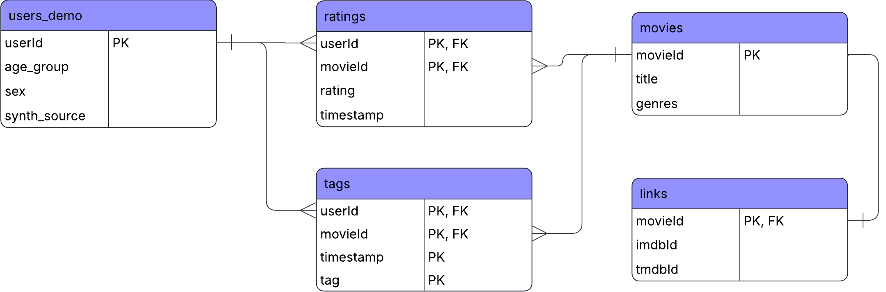

# DS 4320 Project 1: Do User Demographics Improve Movie Recommendation Systems?

### Executive Summary
This repository contains a data pipeline and analysis that evaluate whether user demographic information improves recommendation systems. It includes scripts to construct a relational database from a large-scale user–movie interaction dataset, generate synthetic demographic attributes, and prepare data for modeling. The analysis compares a baseline model using only behavioral data with an enhanced model that incorporates demographics to predict user movie ratings on a 5-star scale. Results show that demographic features provide virtually no improvement in predictive performance, indicating that user behavior alone is sufficient for generating effective recommendations.

**Name**   
Liam Ward 

**NetID**  
vhk7vr

 
[Press Release](./press_release.md) 
[Data Folder](https://myuva-my.sharepoint.com/:f:/g/personal/vhk7vr_virginia_edu/IgC3F2bjh_L_TprKXXsqIxA3AaBD-Z7Mau3JrJMRkB8O-ZQ?e=mDgvAN) 
[Pipeline](./pipeline/) 
[MIT License](./LICENSE) 

## Problem Definition

**General Problem**    
Recommending content

**Refined Problem**    
Determine whether incorporating user demographic information (age group and sex) improves the accuracy of predicting user movie ratings, and therefore leads to better content recommendations, compared to using behavioral data alone.

**Rationale for refinement**   
The general problem of recommending content is broad and involves many possible approaches, including improving algorithms, collecting new data, or refining existing features. This project narrows the focus to a specific and practical question: whether demographic data improves recommendation accuracy. By isolating the impact of demographic features, the project enables a clear, testable evaluation of whether this type of data is worth incorporating into recommendation systems.

**Motivation**  
Content recommendation systems are widely used in platforms such as streaming services, where decisions about what data to collect directly affect system complexity, cost, and user privacy. Demographic information is often assumed to improve personalization, but collecting and using it may not always be necessary. This project is motivated by the need to determine whether demographic data provides meaningful improvements in recommendation accuracy. If it does not, systems can remain simpler, more efficient, and less reliant on sensitive user information.

**[Do Demographics Actually Improve Recommendations?](press_release.md)**

## Domain Exposition

   

**Terminology:**        
| Term | Definition |
|------|------------|
| Collaborative Filtering | A recommendation approach that predicts a user’s movie ratings based on patterns in other users’ ratings, without relying on explicit user attributes. |
| Regression Model | A model used to predict a continuous outcome, here user ratings on a 5-star scale. |
| Ridge Regression | A regularized regression technique that reduces overfitting by penalizing large coefficients. |
| Coefficient | A learned weight indicating how strongly a feature influences predictions. |
| Feature Engineering | The process of transforming raw data (e.g., genres) into model-ready inputs. |
| Train/Test Split | The division of data into training and testing sets to evaluate model performance. |
| RMSE | Root Mean Squared Error, a metric measuring prediction error in rating units (stars). |
| MAE | Mean Absolute Error, the average absolute difference between predicted and actual ratings. |
| Behavioral vs. Demographic Signal | The distinction between predictive information from user interactions versus user attributes. |

  

**Domain:**     
This project operates in the domain of content recommendation systems, which aim to predict user preferences in order to suggest relevant content. A common approach is to estimate how a user would rate an item based on past interactions, allowing systems to prioritize content with higher predicted ratings. These systems typically rely heavily on behavioral data, such as historical ratings, to capture user preferences. However, additional information—such as demographic attributes—is sometimes used in an attempt to improve personalization. This project focuses on evaluating the relative contribution of these different information sources, specifically comparing behavioral signals to demographic signals in the context of predicting user movie ratings and generating recommendations. 

 

**[Background Reading](https://myuva-my.sharepoint.com/:f:/g/personal/vhk7vr_virginia_edu/IgCt6AsfFMQjSZbadmAjBJIvAYJddOvRoTIve25aj9ken2g?e=4Bddu1)**
| Title | Summary |
|------|--------|
| [Collaborative Filtering Using a Regression-Based Approach](https://myuva-my.sharepoint.com/:b:/g/personal/vhk7vr_virginia_edu/IQDZJ3ghexqSSK_x0hqed2AxAXsdYxtx1OHvlTkSu2VkDJU?e=OJIS7F) | Introduces a regression-based method for predicting user–movie ratings using relationships between items. Shows that behavioral rating data alone can produce accurate recommendations, even when data is sparse. |
| [Empirical Analysis of Predictive Algorithms for Collaborative Filtering](https://myuva-my.sharepoint.com/:b:/g/personal/vhk7vr_virginia_edu/IQC6uf_gg7CnRrIvAituIGHKAZU08NbIEmc9-LB2NLr8w7Y?e=qTZElT) | Compares multiple collaborative filtering methods (correlation, Bayesian, etc.) and shows that performance depends heavily on how user rating behavior is modeled, reinforcing the importance of behavioral data over other signals.  |
| [Matrix Factorization Techniques for Recommender Systems](https://myuva-my.sharepoint.com/:b:/g/personal/vhk7vr_virginia_edu/IQAQsgWrw8O1S6cAYN5bWo0OAdVYZmdB1fB4FnuP0_-nYXU?e=AEgQ5a) | Explains modern recommendation approaches that model latent user preferences from rating patterns. Demonstrates how behavioral data can uncover hidden factors driving user choices without requiring explicit user attributes. |
| [The MovieLens Datasets: History and Context](https://myuva-my.sharepoint.com/:b:/g/personal/vhk7vr_virginia_edu/IQCEWdwChx1JRIwKm0OZF1tnARs98qD3RBIIe6PDK5El9Ys?e=bkWvYy) | Describes the structure and evolution of the MovieLens dataset, a widely used benchmark containing user–movie rating interactions. Highlights how recommendation systems are built around user behavior collected through ratings. |
| [A Survey of Collaborative Filtering Techniques](https://myuva-my.sharepoint.com/:b:/g/personal/vhk7vr_virginia_edu/IQBrqQ0hxtpGTKEDqEIKIdcYAUDc4YOiEUuOs0DZCPyL-Ok?e=nRsXQK) | Provides an overview of major recommendation system approaches, including memory-based and model-based methods. Emphasizes that most systems rely primarily on user interaction data rather than demographic information. |

## Data Creation

### Provenance

The dataset used in this project is based on the MovieLens dataset, which contains user–movie ratings collected through an online recommendation platform. The raw data includes user IDs, movie IDs, ratings on a 5-star scale, timestamps, movie metadata, and tags. These files were downloaded from the GroupLens MovieLens repository, extracted locally, and loaded into a DuckDB database as the core relational dataset.

Because the original MovieLens data does not include demographic attributes, synthetic user demographics were generated and added as a separate table. In order to evaluate whether demographic information could improve recommendations, a small controlled demographic signal was introduced into the ratings data before modeling. This created a setting where demographic features had the potential to matter, while still allowing behavioral features to remain the dominant source of predictive information. The resulting database was then used as the basis for analysis.

### Code Table

| File | Brief Description |
|---|---|
| [01_prep_data_refactored.py](./pipeline/01_prep_data_refactored.py) | Downloads the MovieLens data, generates synthetic demographics, injects a small demographic signal into ratings, and loads the final tables into DuckDB. |
| [02_analysis_refactored.py](./pipeline/02_analysis_refactored.py) | Queries the database, engineers model-ready features, performs the train/test split, and fits the baseline and enhanced regression models. |
| [03_visualization_refactored.py](./pipeline/03_visualization_refactored.py) | Creates the final visualization used to compare model performance for the press release and report. |

### Bias Identification

Several forms of bias are present in the data collection process. MovieLens ratings are voluntarily submitted, so the dataset overrepresents more active users and movies that users felt motivated to rate. Missing ratings are also not random, since users are more likely to rate movies they have strong opinions about. In addition, the synthetic demographic variables and the controlled signal added to ratings introduce artificial structure that may not reflect real-world relationships between demographics and preferences.

### Bias Mitigation

These biases are handled by focusing on relative model comparison rather than treating the dataset as a perfectly realistic representation of all users. The demographic signal was intentionally kept small so that it would not dominate the behavioral signal. Model performance was then compared with and without demographic features using the same train/test framework, allowing the analysis to measure whether demographics added meaningful predictive value beyond user behavior alone.

### Rationale for Critical Decisions

The key design decision in this project was the creation of synthetic demographic data. The original MovieLens dataset does not include demographic attributes, but evaluating their impact was central to the research question. Assigning demographics randomly would guarantee they contain no signal, making it impossible to test whether models can actually use them. Instead, synthetic demographics were generated and a small, controlled signal linking them to ratings was introduced. This creates a setting where demographic features are potentially informative but not dominant, allowing the analysis to test whether models can detect and benefit from them. While this approach does not perfectly reflect real-world populations, it provides a controlled and interpretable way to evaluate the role of demographics without trivially biasing the result toward no effect.

## Metadata

### Schema

### Data Tables
| Table | Description | File |
|------|-------------|------|
| ratings | User ratings of movies on a 5-star scale; main interaction table used for modeling | [ratings.parquet](https://myuva-my.sharepoint.com/:u:/g/personal/vhk7vr_virginia_edu/IQDhC86QBb8wQ5XuLndnfL0vAbxpJQDldXemxTaMGz1nAbU?e=P9HkD9) |
| movies | Movie metadata including title and genres | [movies.parquet](https://myuva-my.sharepoint.com/:u:/g/personal/vhk7vr_virginia_edu/IQDtdT6eCEwURorVCFxhZdb0AYmI3ncnnm1zRepDJJEaCfQ?e=WOHbug) |
| tags | User-generated tags describing movies | [tags.parquet](https://myuva-my.sharepoint.com/:u:/g/personal/vhk7vr_virginia_edu/IQA05EkACVflQYbhSHMomAGKAdALtn3sZQKvhZiwn0868Yo?e=Cq7jmv) |
| links | External identifiers linking movies to IMDb and TMDb | [links.parquet](https://myuva-my.sharepoint.com/:u:/g/personal/vhk7vr_virginia_edu/IQAwm1ML-hdESIg9x05W3S8YAbOOBdu0eLrWv2-X0TWD2ak?e=eNf4OR) |
| users_demo | Synthetic user demographic attributes generated from Census-based distributions | [users_demo.parquet](https://myuva-my.sharepoint.com/:u:/g/personal/vhk7vr_virginia_edu/IQCYEXn0TwBHRqEIT0FPAGAPAXuzCwXbY19NlpZV3rhYTaU?e=zDdQ8z) |

### Data Dictionary

**ratings**

| Name | Type | Description | Example |
|------|------|-------------|--------|
| userId | int | Unique identifier for user | 1 |
| movieId | int | Unique identifier for movie | 17 |
| rating | float | User rating (0.5–5.0 scale) | 4.0 |
| timestamp | int | Unix timestamp of rating | 944249077 |

---

 

**movies**

| Name | Type | Description | Example |
|------|------|-------------|--------|
| movieId | int | Unique movie identifier | 1 |
| title | string | Movie title with year | Toy Story (1995) |
| genres | string | Pipe-separated genres | Adventure\|Animation\|Comedy |

---

 

**tags**

| Name | Type | Description | Example |
|------|------|-------------|--------|
| userId | int | User who created tag | 22 |
| movieId | int | Tagged movie | 26479 |
| timestamp | int | Time tag was created | 1583038886 |
| tag | string | Free-text tag | Kevin Kline |

---

 

**links**

| Name | Type | Description | Example |
|------|------|-------------|--------|
| movieId | int | Movie identifier | 1 |
| imdbId | string | IMDb ID | 0114709 |
| tmdbId | int | TMDb ID | 862 |

---

 

**users_demo**

| Name | Type | Description | Example |
|------|------|-------------|--------|
| userId | int | User identifier | 1 |
| age_group | string | Synthetic age bucket | 25–34 |
| sex | string | Synthetic gender category | Male |
| synth_source | string | Source of synthetic generation | ACS_sampled |

---

### Quantification of Uncertainty (Numerical Features)

**rating**
- Discrete scale from 0.5 to 5.0 in 0.5 increments  
- Measurement uncertainty: ±0.25 due to binning  
- Behavioral bias: users may systematically over- or under-rate  

**timestamp (ratings and tags)**
- Stored as Unix time (seconds since epoch)  
- No measurement error, but:
  - uneven user activity over time  
  - temporal sparsity in interactions  

**tmdbId**
- May contain missing values  
- External linkage uncertainty across databases  

**imdbId**
- Stored as string; potential formatting inconsistencies  
- No numeric uncertainty, but integration risk  

**userId / movieId**
- Identifiers, not measured quantities  
- No measurement uncertainty, but:
  - sampling bias in observed users and movies  
