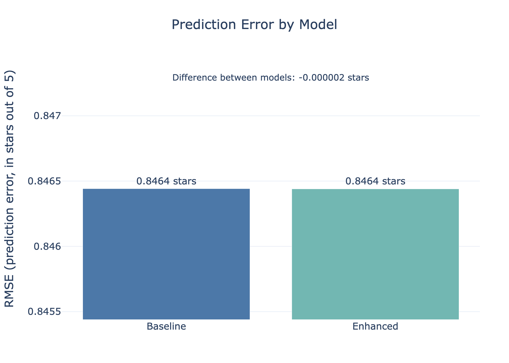

# Do Demographics Actually Improve Recommendations?

## Hook
Recommendation systems shape what people watch, buy, and listen to every day. But do platforms really need personal demographic data to make better recommendations—or is user behavior already enough?

## Problem Statement
Most recommendation systems rely heavily on user behavior, such as past ratings and interactions, to predict what someone will enjoy next. However, many platforms also collect demographic information like age and gender under the assumption that it improves personalization.

This raises an important question: does demographic data meaningfully improve recommendation quality, or does it add unnecessary complexity and potential privacy concerns without real benefit?

## Solution Description
To answer this, we built and compared two recommendation models that predict how a user would rate a movie on a 5-star scale.

The first model uses only behavioral data—how users have rated movies in the past and general movie popularity. The second model includes the same behavioral data, but also incorporates user demographics such as age group and sex.

By directly comparing how accurately each model predicts user ratings, we can measure whether demographic information actually improves recommendations in practice.

## Chart

Both models produce nearly identical prediction accuracy, with differences so small they are effectively negligible.

This suggests that user behavior alone is sufficient for generating high-quality recommendations, and that adding demographic data provides little to no practical benefit.